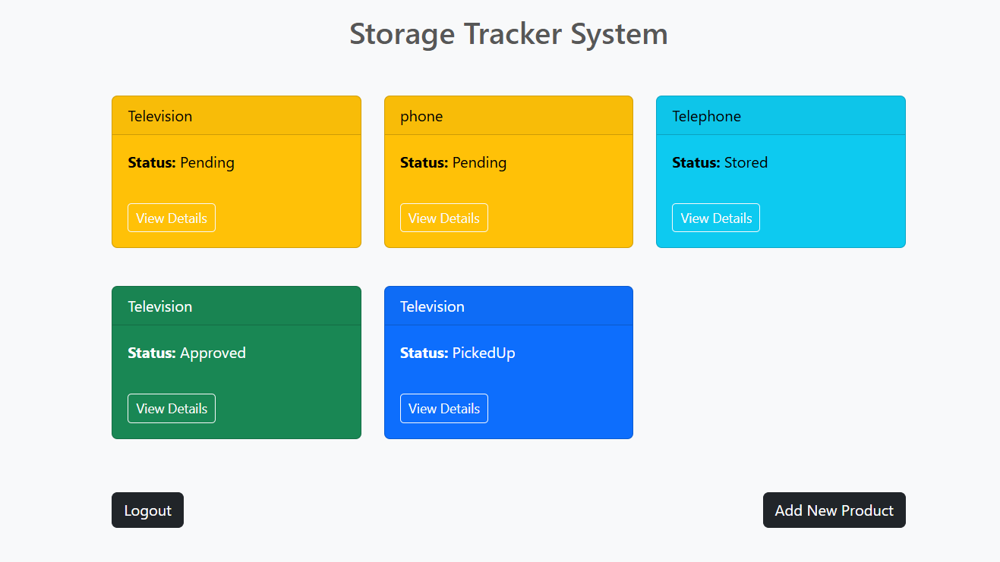
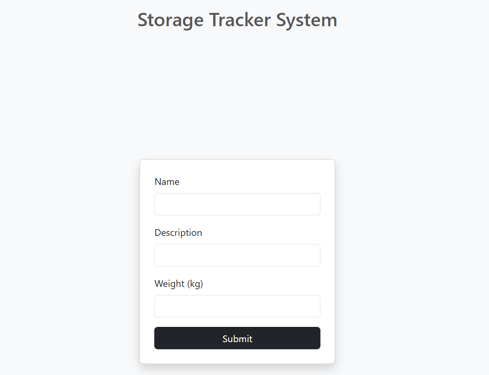
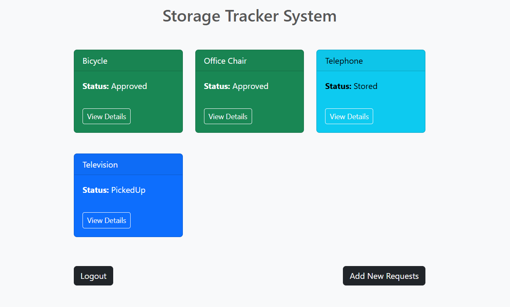
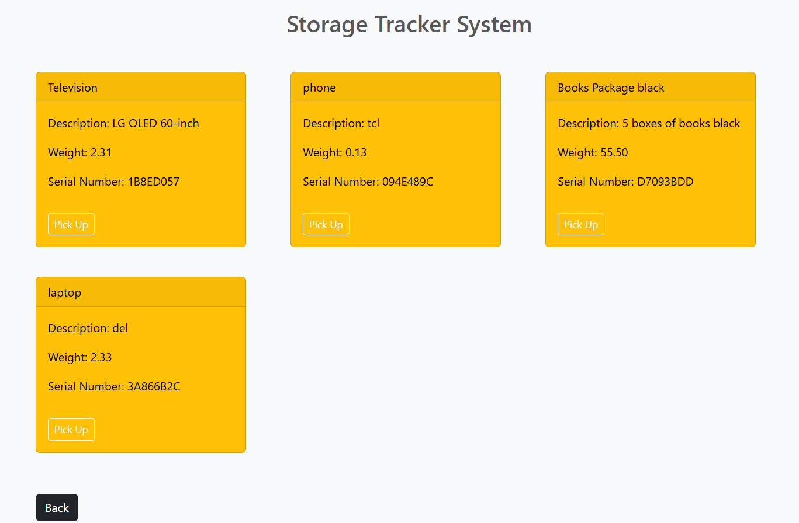

# Frontend - Storage Tracker System (STS)

This is the frontend application of the **Storage Tracker System (STS)**. It provides a user interface for both **customers** and **drivers** to interact with the storage management system. Customers can sign up, log in, and manage their product listings, while drivers can browse available products and submit pickup requests. This application is built with **React** and styled using **Bootstrap**, and it communicates with a Django REST API backend.

---

## Tech Stack

The frontend application was developed using the following technologies:

- **React 19**   
- **React Router DOM 7**  
- **Axios**
- **Vite** 
- **Dotenv**  
- **ESLint** 
- **Bootstrap** 

---

### Backend Repository

> [https://github.com/AyDossari/backend-STS](https://github.com/AyDossari/backend-STS)

---

## Installation Instructions

To run the frontend application locally:

1. Clone the repository:
   ```bash
   git clone https://github.com/AyDossari/Frontend-STS.git
   cd <project-directory>
   ```

2. Install the dependencies:
   ```bash
   npm install
   ```

3. Start the development server:
   ```bash
   npm run dev
   ```

Make sure the backend server is running on the same port as specified in your `.env` file.

---

## Screenshots

Below are key screens from the frontend application showing the flow for both customers and drivers:

### 1. **Home Page** – Landing screen with options for login/signup  
   
  
### 2. **Signup Page** – Form to register as a customer or driver  
   

### 3. **Customer Dashboard** – Shows a list of the customer's submitted products  
   

### 4. **Add Product** – Form for customers to create a new product  
   

### 5. **Driver Dashboard** – Displays the driver’s requests and their statuses  
   

### 6. **Create Request (Driver)** – Interface for the driver to pick up a product  
   

---

## IceBox Features

Features planned for future implementation:

- Improve the UI with a more professional and responsive design  
- Replace basic layout components with a full-featured UI library

## Wins & Challenges

- First time using React, it was a bit hard at the start.  
- I learned how to use components and state.  
- I connected the frontend to the backend and made the app work.